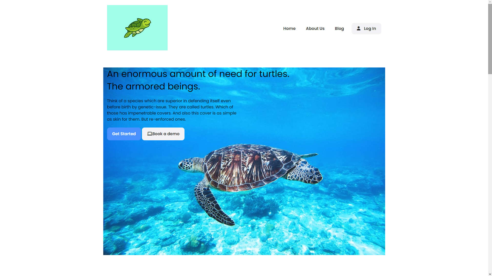
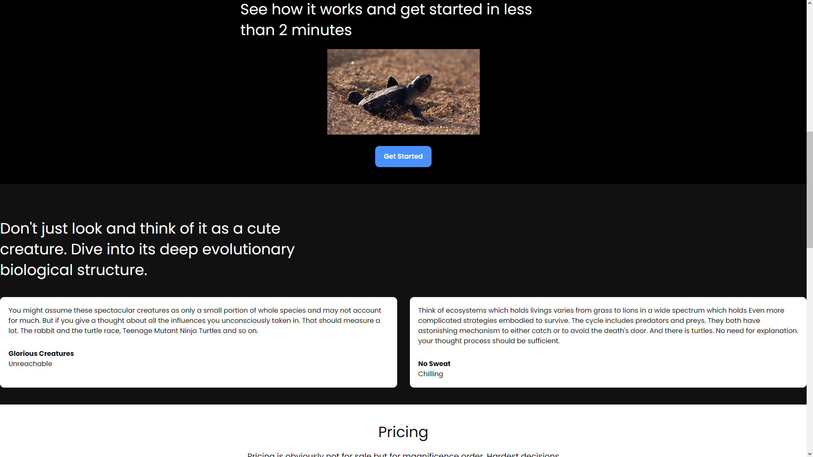
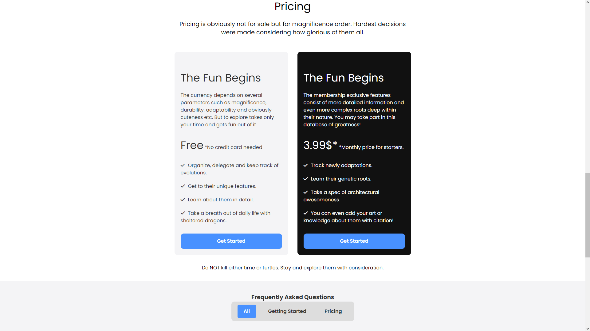
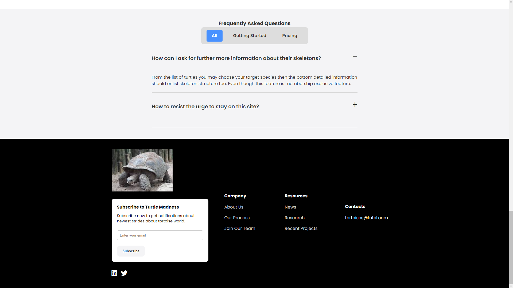

Optimal and Adaptable Frame for Future Projects.

This web design consist of navbar, hero, video, testimonials, pricing, FAQ, footer sections.
Adaptable for both desktop and mobile usages.

It holds unique fonts buttons and text designs.

Aside from project explanation, this entity holds my knowledge about all on html, css, and java coding languages.
I am glad that I could gather them to perform a relatively acceptable job for a web design.

